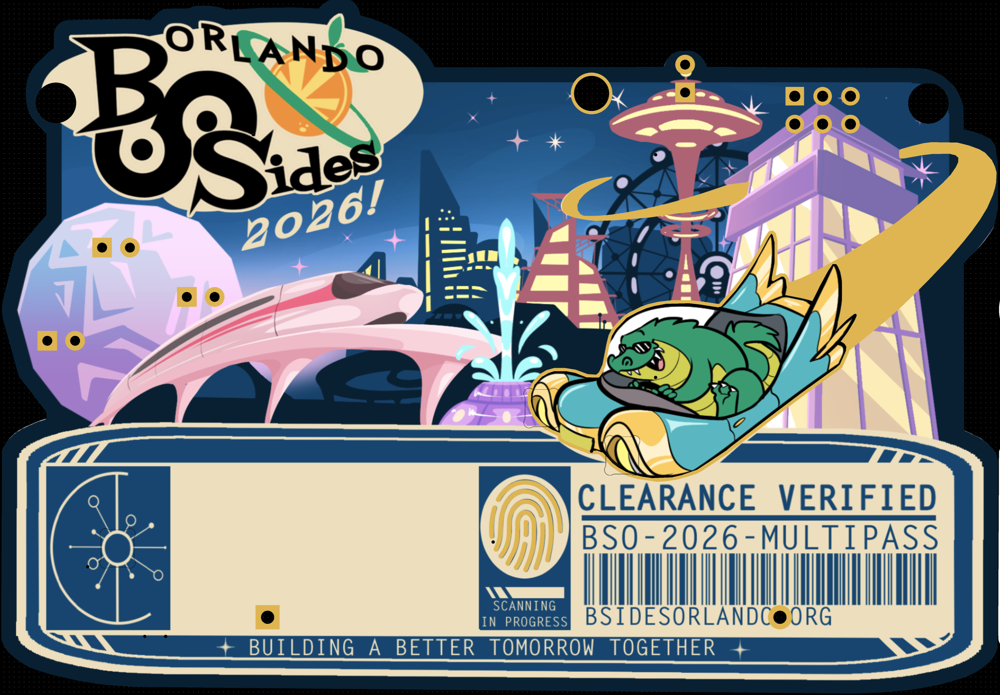
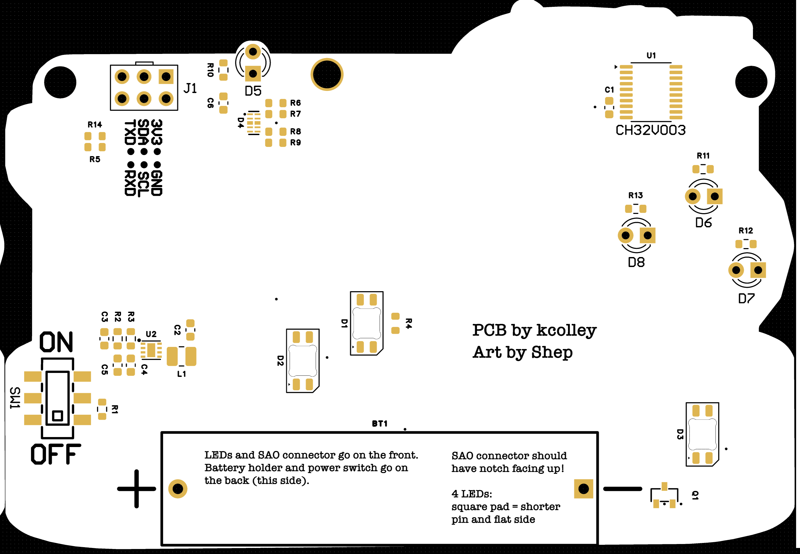
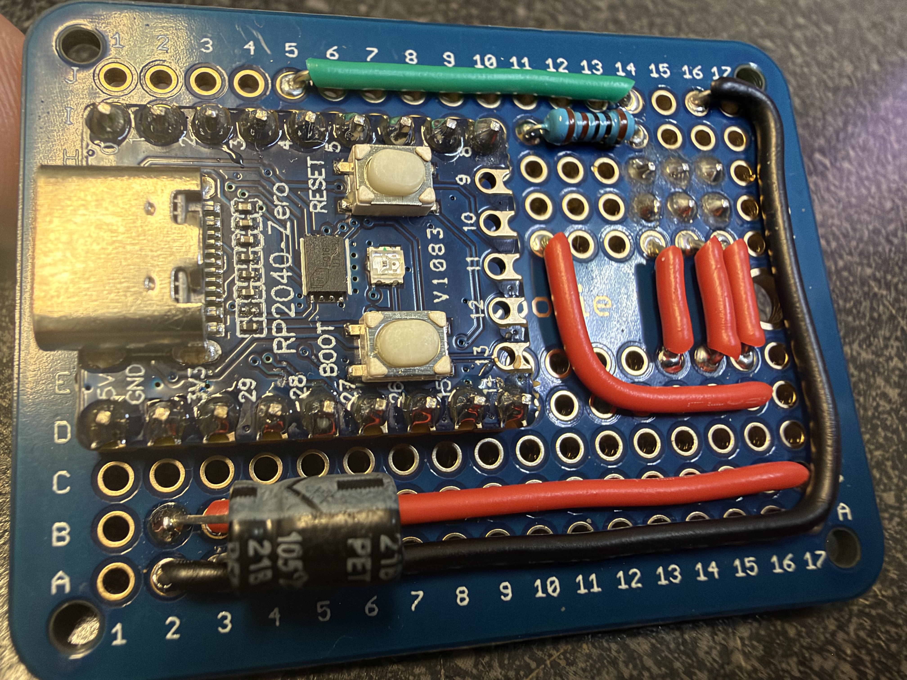

# BSides Orlando 2026 Badge




The electronic badge for BSides Orlando 2026, themed around retro-futurism:
a 1960s World's Fair vision of tomorrow, with Lil Chompy the alligator at
the wheel of a flying car.

- **CH32V003** RISC-V microcontroller, powered by one AAA cell through a
  TPS61021A boost converter.
- **Three SK6812MINI-E RGB LEDs:** the flying car's headlights, and the
  fingerprint scanner indicator.
- **Four self-blinking LEDs:** the tower spire and the geodesic sphere.
- **Two capacitive touch pads:** the fingerprint, and Lil Chompy's head.
- **SAO connector:** the badge is an SAOv3 host on I2C, and GPIO1/GPIO2 carry
  a 115200-baud serial console.
- **Serial console:** runs "Lil Chompy and the World's Fair", a small text
  adventure that doubles as a CTF challenge.

> **Spoilers:** the firmware source contains the CTF solutions and flags.

## Repo layout

| Path | Contents |
| --- | --- |
| `hardware/` | KiCad project (`bsidesorl-v1`), symbol and footprint libraries, and artwork sources |
| `hardware/EasyEDA_Gerber_bsidesorl-v1_2026-08-31.zip` | Gerbers as ordered from JLCPCB |
| `hardware/jlcpcb/` | BOM and CPL as ordered from JLCPCB |
| `hardware/mk_easyeda.py` | Writes an EasyEDA Pro-importable copy of the board |
| `firmware/` | Badge firmware (PlatformIO + [ch32fun](https://github.com/cnlohr/ch32fun)); see [firmware/README.md](firmware/README.md) |

## Firmware quick start

```sh
# saov3-lib's public repo isn't published yet
git submodule update --init

# Build
cd firmware
pio run

# Copy firmware to picorvd-for-badges probe
cp .pio/build/bsorl26/firmware.bin /Volumes/PICORVD/
```

For production, badges are flashed by the standalone programmer build of
[picorvd-for-badges](https://github.com/kjcolley7/picorvd-for-badges)
(an RP2040 probe). It shows up as a USB drive named PICORVD: copy `firmware.bin`
onto it, and set `uart_selftest = 0xB5` in its `CONFIG.TXT` so it triggers the
badge's post-flash self-test over the SWIO pin. Its factory log can be copied
off the same drive as `LOG.CSV`.

## Building your own "programmer SAO"



> Note that in the picture, the SAO connector is connected on G14-H16. The
> traces on the back were cut between G and H to avoid bridging them. The
> SAO connector is oriented so the top is facing downwards in this photo,
> meaning 3V3 is on G16 and GND is on H16.

For this, you need a Raspberry Pi Pico or compatible board. I used a
[WaveShare RP2040-Zero](https://www.amazon.com/dp/B0DXL12W59) board for the
production programmer SAOs that were used in the soldering village at
BSides Orlando, since they're smaller and cheaper than a Raspberry Pi Pico.
To use as a standalone programmer (where the programmer receives power from
the connected target badge), only three wires are needed: GND, 3v3, and the
Pico's GP4 -> badge's RXD (aka PD1/SWIO). On this SWIO connection, you should
also attach a 1KΩ pull-up resistor to 3v3. This can easily be done on a
breadboard with jumper wires.

You'll need to build the picorvd-for-badges firmware for the probe. The exact
version used on the programmer SAOs at the conference can be found pre-built
here: https://github.com/bsidesorlando/2026-badge/releases/download/v1.0.0/pico_rvd_factory.uf2

To build it yourself for the WaveShare RP2040-Zero board:

```bash
git clone https://github.com/kjcolley7/picorvd-for-badges.git
cd picorvd-for-badges
cmake -B build-zero -G Ninja -DPICO_BOARD=waveshare_rp2040_zero
ninja -C build-zero pico_rvd_factory
```

The above commands create `build-zero/pico_rvd_factory.uf2`, which should be
uploaded to the probe by putting it in BOOTSEL mode and then copying it to the
USB Mass Storage device it exposes. Then, the probe will reboot into the picorvd
firmware and the USB Mass Storage device will re-appear with the name "PICORVD".
Now, it's ready to accept firmware and configuration. You can upload the BSORL
badge firmware from `.pio/build/bsorl26/firmware.bin` (or the pre-built one from
here: https://github.com/bsidesorlando/2026-badge/releases/download/v1.0.0/firmware.bin)
by copying it into the PICORVD volume (which will disappear and reappear as the
probe reboots), and you can also edit the probe's CONFIG.TXT to add
`uart_selftest = 0xB5` (so the probe tells the BSORL badge to enter selftest mode
after programming). At this point, the probe is fully ready to go, either in
standalone mode or tethered mode.

### Standalone mode

This is the mode that was used at BSides Orlando for programming all of the
attendees' badges in the soldering village. It works by powering the probe board
from the target badge itself, and it immediately attempts to program the
connected target upon boot. The badge needs to be powered on so the probe itself
can be powered.

### Tethered mode

This mode works by leaving the probe connected to a host PC over USB. If you
use pico_rvd.uf2 instead of pico_rvd_factory.uf2, the probe won't automatically
program connected badges. Rather, you'll need to manually issue the `factory`
command to the probe over its UART interface. In the pico_rvd_factory.uf2 build,
it will automatically start in factory mode, ready to program any connected
badges.

**NOTE**: Do NOT connect a probe with USB power to a badge while it is switched
on. The power switch should be in the OFF position before connecting a tethered
probe. The badge and the probe will likely have slightly different values than
exactly 3.3v, so there will be some current leakage. Worst case, it could damage
the AAA battery, causing it to leak.

## Credits

PCB and firmware by Kevin Colley. Art by Shep.
