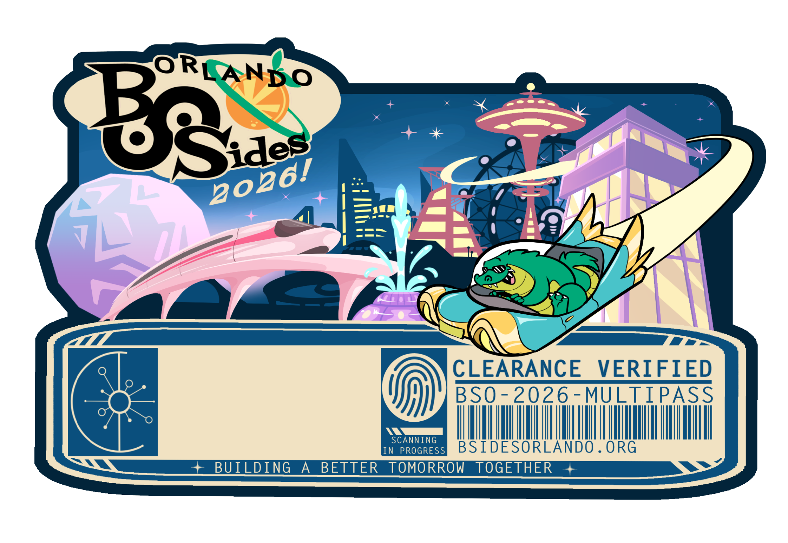

# BSides Orlando 2026 Badge



The electronic badge for BSides Orlando 2026, themed around retro-futurism:
a 1960s World's Fair vision of tomorrow, with Lil Chompy the alligator at
the wheel of a flying car.

- **CH32V003** RISC-V microcontroller, powered by one AAA cell through a
  TPS61021A boost converter.
- **Three SK6812MINI-E RGB LEDs:** the flying car's headlights, and the
  fingerprint scanner indicator.
- **Four self-blinking LEDs:** the tower spire and the geodesic sphere.
- **Two capacitive touch pads:** the fingerprint, and Lil Chompy's head.
- **SAO connector:** the badge is an SAOv3 host on I2C, and GPIO1/GPIO2 carry
  a 115200-baud serial console.
- **Serial console:** runs "Lil Chompy and the World's Fair", a small text
  adventure that doubles as a CTF challenge.

> **Spoilers:** the firmware source contains the CTF solutions and flags.

## Layout

| Path | Contents |
| --- | --- |
| `hardware/` | KiCad project (`bsidesorl-v1`), symbol and footprint libraries, and artwork sources |
| `hardware/jlcpcb/` | Gerbers, BOM and CPL as ordered from JLCPCB |
| `hardware/mk_easyeda.py` | Writes an EasyEDA Pro-importable copy of the board |
| `firmware/` | Badge firmware (PlatformIO + [ch32fun](https://github.com/cnlohr/ch32fun)); see [firmware/README.md](firmware/README.md) |

## Firmware quick start

```sh
git submodule update --init   # saov3-lib's public repo isn't published yet
cd firmware
pio run                       # build
pio run -t upload             # flash via a picorvd-for-badges probe
```

For production, badges are flashed by the standalone programmer build of
[picorvd-for-badges](https://github.com/kjcolley7/picorvd-for-badges) (an RP2040 probe). It shows up as a USB drive
named PICORVD: copy `firmware.bin` onto it, and set `uart_selftest = 0xB5` in
its `CONFIG.TXT` so it triggers the badge's post-flash self-test over the
SWIO pin. Its factory log can be copied off the same drive as `LOG.CSV`.

## Credits

PCB and firmware by Kevin Colley. Art by Shep.
